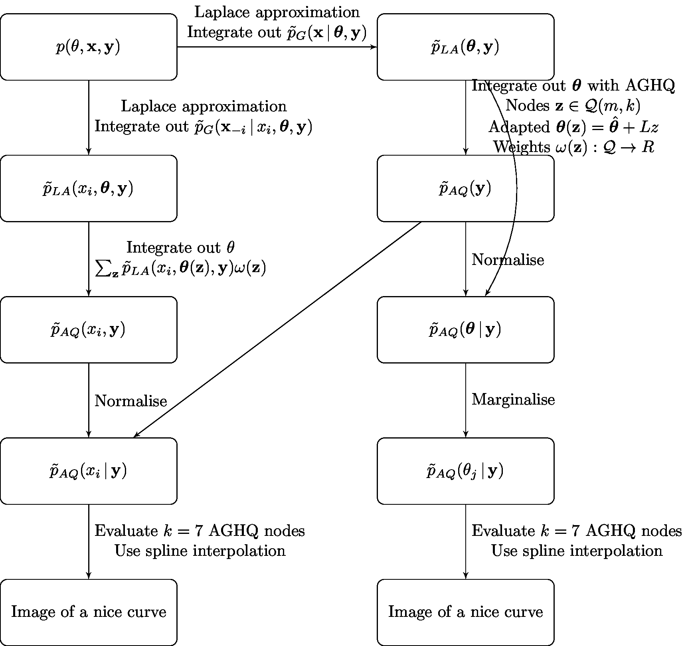

# elgm-inf

[Naomi](https://github.com/mrc-ide/naomi) ([Eaton et al, 2021](https://onlinelibrary.wiley.com/doi/10.1002/jia2.25788)) is a spatial evidence synthesis model used to produce district-level HIV epidemic indicators in sub-Saharan Africa.
Multiple outcomes of interest, including HIV prevalence, HIV incidence and treatment coverage are jointly modelled using both household survey data and routinely reported health system data.
The model is provided as a [tool](https://naomi.unaids.org/) for countries to input their data to and generate estimates.
In this setting, computationally intensive inference methods like MCMC are impractical.
We propose a new inference method which combines the simplified integrated nested Laplace approximation approach of [Wood (2020)](https://academic.oup.com/biomet/article/107/1/223/5572662) with adaptive Gauss-Hermite quadrature to enable fast and accurate inference for Naomi and other [extended latent Gaussian](https://www.tandfonline.com/doi/full/10.1080/10618600.2022.2099403) models.
Using data from Malawi, our method provides substantially more accurate inferences than the empirical Bayes Gaussian approximation approach used currently, and is comparable to Hamiltonian Monte Carlo with the No-U-Turn sampler.
By extending the [`aghq`](https://github.com/awstringer1/aghq) package (Stringer, 2021) we facilitate flexible and easy use of our method when provided a [`TMB`](https://kaskr.github.io/adcomp/_book/Introduction.html) C++ template for the log-posterior.



## R package dependencies

This repository is supported by the [`inf.utils`](https://github.com/athowes/inf.utils) package, which can be installed from Github via:

```r
devtools::install_github("athowes/inf.utils")
```
