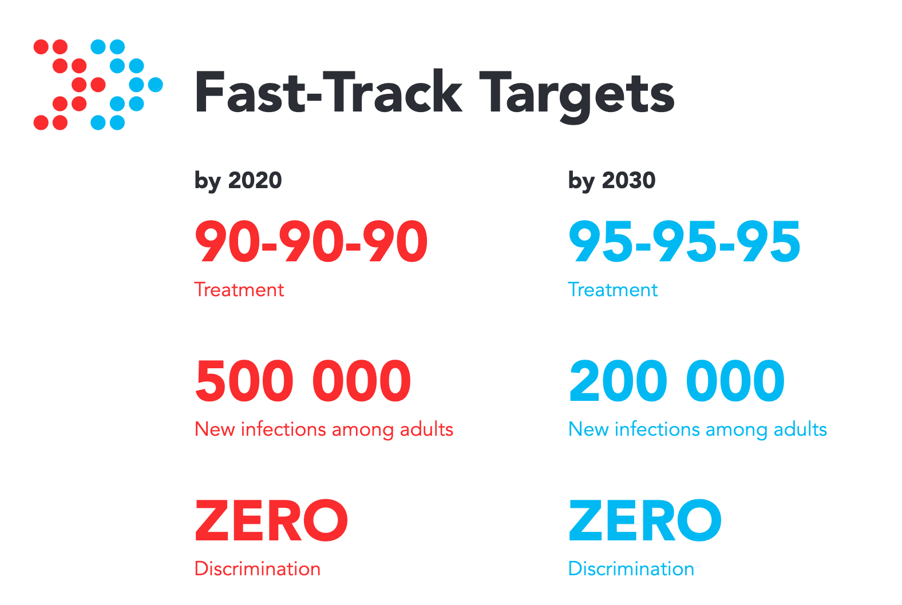

# 

```{r, echo=FALSE, fig.cap="Ambitious targets required to end the AIDS epidemic as a public health threat by 2030.", out.width = '70%'}

```

# 

```{r, echo=FALSE, fig.cap="More effective intervention based on granular estimates of HIV indicators. One size does not fit all!", out.width = '90%'}
cbpalette <- c("#56B4E9", "#009E73", "#E69F00", "#F0E442", "#0072B2", "#D55E00", "#CC79A7", "#999999")

knitr::include_graphics("depends/naomi_results.png")
```

# 

```{r, echo=FALSE, fig.cap="Generation of estimates by country teams strengthens data quality, use and ownership. User interface from \\texttt{https://naomi.unaids.org/}.", out.width = '70%'}
knitr::include_graphics("naomi_user.png")
```

#

:::::::::::::: {.columns}

::: {.column width=.5}

\textcolor{hilit}{Want}

Fast approximate Bayesian inference for a complex, spatiotemporal, evidence synthesis model

:::

::: {.column width=.5}

\textcolor{hilit}{Strategy}

1. Marginal Laplace approximation
2. Adaptive Gauss-Hermite quadrature
3. Principal components analysis

:::

::::::::::::::

#

```{r message=FALSE, echo=FALSE, fig.cap="A Gamma prior with $a = 3$ and $b = 1$."}
cbpalette <- c("#56B4E9","#009E73", "#E69F00", "#F0E442", "#0072B2", "#D55E00", "#CC79A7", "#999999")

a <- 3
b <- 1

prior <- ggplot(data = data.frame(x = c(0, 10)), aes(x)) +
  stat_function(fun = dgamma, n = 500, args = list(shape = a, rate = b), col = cbpalette[1]) +
  annotate("text", x = 6, y = 0.15, label = "Gamma(3, 1) prior", col = cbpalette[1], size = 5) +
  labs(x = "", y = "") +
  theme_minimal()
  
prior
```

#

```{r message=FALSE, echo=FALSE, fig.cap="Draw 3 points from $\\text{Poisson}(3)$, then compute the posterior."}
set.seed(2)
y <- rpois(3, lambda = 2)

posterior <- prior +
  geom_point(data = data.frame(x = y, y = 0), aes(x = x, y = y), inherit.aes = FALSE, alpha = 0.7, size = 2) +
  stat_function(data = data.frame(x = c(0, 10)), aes(x), fun = dgamma, n = 500, args = list(shape = a + sum(y), rate = b + length(y)), col = cbpalette[2]) +
  annotate("text", x = 6, y = 0.25, label = "Gamma(9, 4) posterior (known)", col = cbpalette[2], size = 5)

posterior
```

#

```{r message=FALSE, echo=FALSE, fig.cap="The Laplace approximation in this case is good near the mode but not in the tails."}
fn <- function(x) dgamma(x, a + sum(y), b + length(y), log = TRUE)

ff <- list(
  fn = fn,
  gr = function(x) numDeriv::grad(fn, x),
  he = function(x) numDeriv::hessian(fn, x)
)

opt_bfgs <- aghq::optimize_theta(
  ff, 1, control = aghq::default_control(method = "BFGS")
)

laplace <- posterior +
  stat_function(
    data = data.frame(x = c(0, 10)),
    aes(x),
    fun = dnorm,
    n = 500,
    args = list(mean = opt_bfgs$mode, sd = sqrt(1 / opt_bfgs$hessian)),
    col = cbpalette[3]
  ) +
  annotate("text", x = 5, y = 0.4, label = "Laplace approximation", col = cbpalette[3], size = 5)

laplace
```

#

* For Malawi, the model has 491 parameters
* 467 have a joint Gaussian prior: call them the latent field $x$
* 24 are not Gaussian: call them hyperparameters $\theta$
* Use the \textcolor{hilit}{Laplace} approximation only for the latent field \textcolor{hilit}{marginal} posterior!

#

```{r echo=FALSE, warning =FALSE, out.height = '70%', fig.cap = "Spatial random effects $\\phi_i \\, | \\, \\phi_{-i} \\sim \\mathcal{N} \\left(\\frac{1}{n_{\\delta i}} \\sum_{j: j \\sim i} \\phi_j, \\frac{1}{n_{\\delta i}\\tau_\\phi} \\right)$ are included in the latent field. We assume that neighbouring districts are similar: first law of geography."}
area_merged <- sf::read_sf(system.file("extdata/demo_areas.geojson", package = "naomi"))

sf <- area_merged %>%
  filter(area_level == 3)

nb <- sf_to_nb(sf)
  
nb_sf <- spdep::nb2lines(nb, coords = sp::coordinates(as(sf, "Spatial"))) %>%
  as("sf") %>%
  sf::st_set_crs(sf::st_crs(sf))

b <- ggplot2::ggplot(sf) +
  ggplot2::geom_sf(data = nb_sf) +
  ggplot2::theme_minimal() +
  ggplot2::labs(subtitle = "Graph") + 
  ggplot2::theme_void()
  
a <- ggplot2::ggplot(sf) +
  ggplot2::geom_sf() +
  ggplot2::theme_minimal() +
  ggplot2::labs(subtitle = "Geography") + 
  ggplot2::theme_void()

a + b
```

#

```{r, echo=FALSE, message=FALSE, fig.cap="Unadapted Gauss-Hermite points in two dimensions with $k = 3$."}
mu <- c(1, 1.5)
cov <- matrix(c(2, 1, 1, 1), ncol = 2)

obj <- function(theta) {
  mvtnorm::dmvnorm(theta, mean = mu, sigma = cov)
}

grid <- expand.grid(
  theta1 = seq(-2, 5, length.out = 700),
  theta2 = seq(-2, 5, length.out = 700)
)

ground_truth <- cbind(grid, pdf = obj(grid))

plot0 <- ggplot(ground_truth, aes(x = theta1, y = theta2, z = pdf)) +
  geom_contour(col = cbpalette[1]) +
  coord_fixed(xlim = c(-2, 4.5), ylim = c(-2, 4.5), ratio = 1) +
  labs(x = "", y = "") +
  theme_minimal()

gg <- mvQuad::createNIGrid(2, "GHe", 3)

add_points <- function(plot0, gg) {
  plot0 +
    geom_point(
      data = mvQuad::getNodes(gg) %>%
              as.data.frame() %>%
              mutate(weights = mvQuad::getWeights(gg)),
      aes(x = V1, y = V2, size = weights),
      alpha = 0.8,
      col = cbpalette[2],
      inherit.aes = FALSE
    ) +
    scale_size_continuous(range = c(1, 2))
}

add_points(plot0, gg) +
  labs(size = "Weight", caption = "")
```

#

```{r, echo=FALSE, message=FALSE, fig.cap="Add the mean $z + \\hat \\theta$."}
gg2 <- gg
mvQuad::rescale(gg2, m = mu, C = diag(c(1, 1)), dec.type = 2)

add_points(plot0, gg2) +
  labs(size = "Weight", caption = "")
```

#

```{r, echo=FALSE, message=FALSE, fig.cap="First option: rotate by the lower Cholesky $Lz + \\hat \\theta$."}
gg3 <- gg
mvQuad::rescale(gg3, m = mu, C = cov, dec.type = 2)

add_points(plot0, gg3) +
  labs(size = "Weight", caption = "")
```

#

```{r, echo=FALSE, message=FALSE, fig.cap="Second option: rotate using the eigendecomposition $E \\Lambda^{1/2} z + \\hat \\theta$."}
gg3 <- gg
mvQuad::rescale(gg3, m = mu, C = cov, dec.type = 1)

add_points(plot0, gg3) +
  labs(size = "Weight", caption = "")
```

#

```{r, echo=FALSE, message=FALSE, fig.cap="Now keeping only the first principal component, $s = 1$."}
gg4 <- mvQuad::createNIGrid(2, "GHe", level = c(3, 1))
mvQuad::rescale(gg4, m = mu, C = cov, dec.type = 1)

add_points(plot0, gg4) +
  labs(size = "Weight", caption = "")
```

#

```{r, echo=FALSE, fig.cap="Scree plot suggests 10 or so dimensions is enough. We use $s = 8$ to avoid long computation times.", out.width = '80%'}
knitr::include_graphics("depends/tv-plot.png")
```

#

```{r, echo=FALSE, fig.cap="With 8 dimenions, the hyperparameter covariance matrix is accurately reproduced.", out.width = '80%'}
knitr::include_graphics("depends/reduced-rank-plot.png")
```

#

```{r, echo=FALSE, fig.cap="Reduced RMSE by 10%, but still a work in progress! Also using Kolmogorov-Smirnov tests, Pareto-smoothed importance sampling, maximum mean discrepancy...", out.width = '80%'}
knitr::include_graphics("depends/second90.pdf")
```

# Thanks for listening!

* For more about Naomi, see @eaton2021naomi
* Joint work with Alex Stringer (Waterloo), Seth Flaxman (Oxford), and Jeff Eaton (Harvard, Imperial)
* For more about me, see `athowes.github.io/about`

```{r echo=FALSE, out.width = "300px", fig.align='center'}

```

# References {.allowframebreaks}
