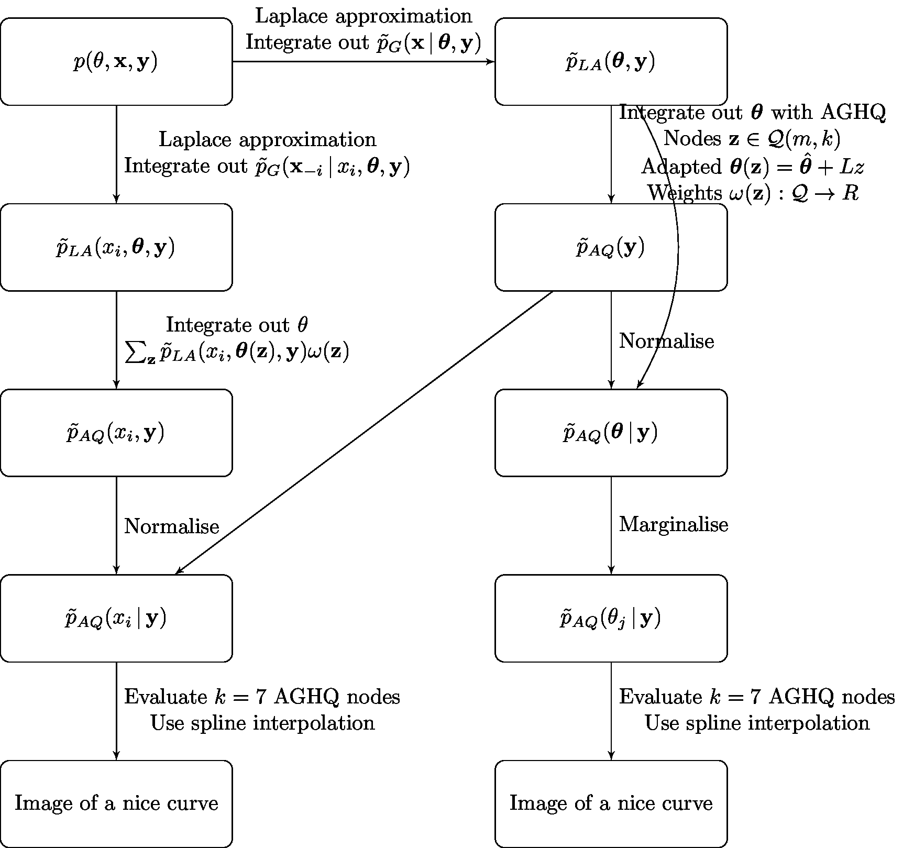

## Summary

* Approximate Bayesian inference method using adaptive Gauss-Hermite quadrature and Laplace approximation
* Implemented as a part of the `aghq` package, allowing easy use for any model with a `TMB` C++ user template
* Motivated by a challenging problem in evidence synthesis for small-area estimation of HIV

<!-- 38761C -->

## The Naomi HIV model

* Spatio-temporal small-area estimation model of HIV indicators which combines data from household surveys, antenatal care clincs, and routine service provision of antiretroviral therapy [@eaton2021naomi]
* Yearly estimation process where the model is run interactively by country teams using the web-app `naomi.unaids.org`
* Inference currently conducted with empirical Bayes and a Gaussian approximation to the latent field using Template Model Builder `TMB` [@kristensen2016tmb]
* Model incompatible with the `R-INLA` implementation of integrated nested Laplace approximations [@rue2009approximate] and takes days to get accurate answers with Markov chain Monte Carlo via `tmbstan` [@monnahan2018no]
* Fits into the recently described class of extended latent Gaussian models [@stringer2022fast]

## Inference procedure

### Laplace approximation

* Integrate out variables using a Gaussian approximation in the denominator
$$
p(\theta, y) \approx \tilde p_\text{LA}(\theta, y)
$$
where 

### Adaptive Gauss-Hermite Quadrature

* Approximate integrals by $\int_\Theta p(\theta) \text{d} \theta \approx \lvert L \rvert \sum_{z \in \mathcal{Q}(m, k)} p(\hat \theta + Lz) \omega(z)$ with Gauss-Hermite quadrature rule $z \in \mathcal{Q}(m, k)$ adapted based upon the mode $\hat \theta = \text{argmax}_{\theta \in \Theta} \in p(\theta)$ and lower Cholesky $LL^\top = - \partial_\theta^2 \log p(\theta) \rvert_{\theta = \hat \theta}$ of the target

### Our algorithm

Given C++ user template for $- \log p(y, x, \theta)$:

```{r echo=FALSE, fig.align='center', out.width='100%'}

```

## Inference comparison

* Compare posterior inferences from `TMB`, `aghq` and `tmbstan` using Kolmogorov-Smirnov tests on posterior marginals
* Find that...

<font size="6"> **Funding** AH was supported by the EPSRC and Bill & Melinda Gates Foundation. This research was supported by the MRC Centre for Global Infectious Disease Analysis. </font>

## References

<font size="6"> <div id="refs" class="references"></div> </font>
