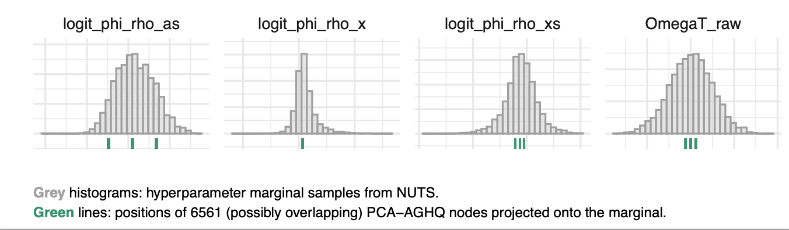

```{r echo = FALSE, message = FALSE}
library(dplyr)

options(scipen = 100)

knitr::opts_chunk$set(
  echo = FALSE,
  warning = FALSE,
  message = FALSE,
  dpi = 320,
  cache = TRUE,
  out.width = "95%",
  fig.align = "center",
  fig.pos = "!h",
  out.extra = ""
)

knitr::opts_chunk$set()
```

\clearpage

# Introduction

Thank you for taking the time to read and review our paper "Fast approximate Bayesian inference of HIV indicators using PCA adaptive Gauss-Hermite quadrature".
In what follows we address your comments and suggestions point by point.
We appreciate the feedback to improve the work and have made the relevant changes to the manuscript.

# Reviewer 1

\begin{reviewer}
The class of models to which the present model is assigned, namely Extended Latent Gaussian Models (ELGMs), is very broad, and in my (perhaps rather curmudgeonly) opinion too broad to be of much value. On page 3 the authors write about the new mapping structure for ELGMs which is said to "relax the restriction that there is a one-to-one mapping between the mean response mu and structured additive predictor eta." and "Importantly, this mapping allows for the presence of non-linearity in the model." What exactly is meant by this? The original link function of LGMs can be non-linear of course, though it must sets up invertibility which is easy if it is one-to-one in that sense. Here the many-to-one refers to a mapping from multiple latent parameters to a combined latent parameter, so for example if we're talking about direct summation then yes we can have equality on a set of zero-measure for the many (the pull back of the 'one'), but I bet that for the model to work (in the sense of obeying the conditions of the ELGM convergence proofs) we couldn't, say, define the mapping such that its pull-back is sometimes a set of measure zero and sometimes a set of non-zero measure. It probably wouldn't work if we did a non-linear mapping like the product of the many. But who knows, because all this is left to the user of the ELGMs to figure out: that is, the original ELGM paper is constructed backwards: rather than defining a very strict model class with conditions that ensure a shared computability and set of theoretical results (like the LGM or GLM class) it is instead defined very loosely, meaning that finding out if it's computable using the given algorithms is left up to the user. Rant over. What can the authors do in the present paper? First, I would suggest to be clear on page 3 about what kind of mappings are being done in this model and see if these also match to a named smaller class within the ELGM class, and/or identify fuzzy matches to existing model structures of this form (such as Katie Wilson's "pointless spatial models"); especially those use in spatial statistics and/or epi.
\end{reviewer}

Response here.

\begin{reviewer}
I'm not an expert on the various flavours of NUTS algorithms but from my experience I have always been disappointed in the performance of tmbstan. Are there any comparisons between tmbstan and ordinary stan not conducted by the tmbstan package authors? Do people use tmbstan much in research? The software paper is well-cited but a lot of citations seem to be from other people just talking about software or HMC generally. Perhaps the best way to ally my concern that tmbstan might not be a good benchmark would be to check and explain in the paper whether its flavour of NUTS implementation is comparable to that now used in Stan? If not, perhaps see if a caveat is needed, something along the lines of 'tmbstan was tested because it's compatible with the idea of repurposing existing software (i.e., the original TMB template) but this doesn't mean that rebuilding the model from scratch in Stan, for instance, would create a sampler just as impractically slow'.
\end{reviewer}

`tmbstan` passes the objective function and its gradient (calculated in `TMB`) directly to `rstan` via the [`op_matrix_vari`](https://mc-stan.org/math/classstan_1_1math_1_1op__matrix__vari.html).
As such, the NUTS algorithm used should be the same.
Nonetheless, it could be that there are speed differences between function evaluations in `TMB` and Stan.
We have added a sentence to the discussion noting this possible comparison:

> Additionally, direct implementation of Naomi within the Stan PPL could alter the speed by as much as plus or minus 50% [@monnahan2018no] and would give access to other algorithms implemented in Stan such as variational inference [@kucukelbir2015automatic] and Pathfinder [@zhang2022pathfinder].

\begin{reviewer}
The equation for the fraction recently infected on page 17 puzzles me; though I don't come from the HIV field. It seems to me that this is a convenience 'guesstimation' used only as an output for end users, rather than being fitted to data or offering some kind structural constraint on the fits? Can these model outputs be pushed into a compartmental model later to give 'proper' incidence estimates, i.e., ones inferred from changes to prevalence and death rates? Also, presumably the epidemiology prescribes some tight bounds on the ANC offsets given the demography of birth and sexual partnership; are these pre-built into the priors for the model?
\end{reviewer}

Some HIV surveys provide bio-marker data on whether or not the infection was recent.
Equation 7 links the probability of recent infection to HIV prevalence, HIV incidence, and properties of the recent infection assay.
This allows us to back-out estimates of the HIV incidence.
<!-- Is there something to add to the manuscript here? -->

We agree that tightening the bounds on the ANC offsets would be an important step for improving estimates of HIV incidence.
Work is ongoing to improve the Naomi model [@esra2024improved].
<!-- Has this work been included yet, or it's still to be done in future? -->

\begin{reviewer}
You anticipated my very clever idea for improving the performance of the PCA algorithm: namely, to consider the relevance of each dimension to a measure of uncertainty relevant to the end predictive purposes. Are calculations of this nature possible with TMB as it stands, or would one need to dig into the bowels of the c++ code and create a TMB package extension? I think this is an interesting area for future work.
\end{reviewer}

It is possible to obtain derivative information about a quantity in a `TMB` model using `ADREPORT`.

\begin{reviewer}
Finally, on page 17 it feels like Bayesian 'optimisation' is another natural competitor in this space, especially since it's quite straightforward to just run this kind of algorithm to explore hyper parameters until you get bored or run out of time, i.e., you get what you get from stopping early, unlike HMC for instance.
\end{reviewer}

The goal of Bayesian optimisation (BO) is to find the maximum of a (black box) function.
For this reason, we do not see BO as a competitor to algorithms (like ours) intended to perform Bayesian inference.
(One could imagine using BO to optimise the hyperparameters, however it would be preferable to use gradients [as they are available].)

\begin{reviewer}
Typos spotted:
p2 "closer [to]"
p4. "hyperparmters"
\end{reviewer}

Thank you for spotting these two typographic errors.
We have corrected them in the manuscript.

# Reviewer 2

\begin{reviewer}
The NUTS sampler was run for 4 chains for 100,000 iterations, with the first half discarded. This gives a lowest ESS of 208 and a largest Rhat of 1.021. This run took 79 hours. While this run is pretty reasonable for applied work, I do worry about it being used as a gold standard to compare against. Given that the authors are comparing the full posterior distribution, the tails are quite important which will be poorly characterised with ESS of 208. The Rhat of 1.021 is just about ok, so only slightly longer runs, but many more chains would, at fairly little expense, really improve the ESS. Can the model be run with 16 chains on an HPC or something?
\end{reviewer}

We agree that running more iterations of the NUTS sampler is a good idea, and could improve the minimum ESS and accuracy of any comparisons, especially distributional ones.
We have rerun the NUTS sampler using a HPC with the 18 chains (across 18 cores) with 120,000 iterations each.

\begin{reviewer}
I really like Figure 5 but just a few more words explaining the green lines would be useful. My first thought was that there was 1 or 3 green lines and that the width meant something. I realise now it's 6561 green lines that either overlap or join together to make thick lines. Perhaps some alpha would help communicate this.
\end{reviewer}

Thank you for the suggestion.
We have adjusted the `alpha` value from 0.5 to 0.1 and added a caption to the figure explaining the possible overlap to make Figure 5 clearer:

```{r}

```

\begin{reviewer}
In Figure 6, is the y axis NUTS estimate - GEB estimate? Or the other way around? For the posterior SD, you can interpret positive and negative errors as being conservative or anti-conservative. The new method moves the 3 little clusters at 1.1, 1.4 and 1.8 from negative to positive which seems it could be important and worth noting.
\end{reviewer}

Yes that is correct, it's the NUTS estimate minus the GEB or GPCA-AGHQ estimate.
We have clarified the $y$-axis here (and where relevant throughout the manuscript) to read "Absolute difference (NUTS - method)".

\begin{reviewer}
Figure 7 is very hard to read. It's an interesting and useful plot. However, I would much prefer the labels to be proper greek characters. And there is just too many colours, so I think it needs to be split into 4 or so groups on seperate panels.
\end{reviewer}

We agree that there are too many colours here for this figure to be clear, and that the suggestion to split the figure across panels is a good one.
To do this, we have grouped the parameters by the model component (e.g. HIV prevalence), and used colour to represent the type of parameter (e.g. intercept).
The updated version of Figure 7 is shown below:

```{r}
knitr::include_graphics("depends/ks-summary.png")
```

\begin{reviewer}
The authors mention that the method is tunable with how many PCA components are selected and what value of k to use. It is a bit of a shame that one or two other options are not examined. But I understand it is already a lot of work to describe all the results. Given that this model is now on the slow side, I would prioritise examining a method that accounts for 80% of the variance, i.e. a faster model rather than a more accurate model. So I will leave it to the authors whether or not to do more work here.
\end{reviewer}

We agree that it would be of interest to explore the effect of choosing a different number of PCA components ($s$) and number of quadrature points per dimension ($k$).
One could also consider a varying number of quadrature points.
For example "gradually lowering $k$ over the principal components" presumably would be the most efficient approach.

\begin{reviewer}
Just looking at Figure 2, a useful intermediate scheme to me seems to be to drop the corners of the grid. So you would be left with 5 points. That said, I think the benefit of this reduces as you get to higher dimensions. So please don't take this comments as work to be done, but rather as an interesting idea for future work.
\end{reviewer}

We agree that this could be a useful approach.
Indeed Section 6.1.2. reads "Finally, it is likely possible to achieve better performance by pruning and prerotation of the quadrature grid, as discussed by @jackel2005note.".
We believe the suggested approach is what we refer to here (very briefly) as "pruning".
To clarify this point, we have rewritten this sentence as:

> Finally, it is likely possible to achieve better performance by pruning (dropping points where the weight is below some threshold) or prerotation (before adaption, in order to e.g. achieve better coverage along the principal axis) of the quadrature grid [@jackel2005note].

# References {#references .unnumbered}
