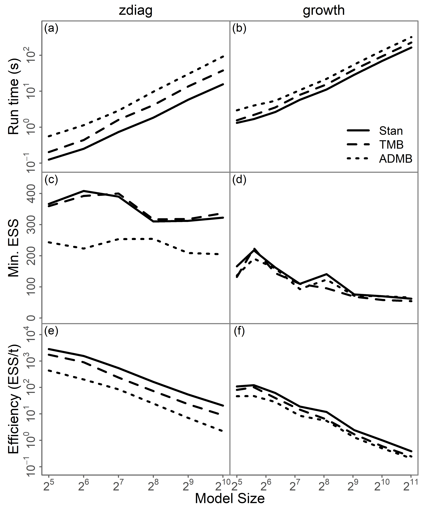

```{r echo = FALSE, message = FALSE}
library(dplyr)

options(scipen = 100)

knitr::opts_chunk$set(
  echo = FALSE,
  warning = FALSE,
  message = FALSE,
  dpi = 320,
  cache = TRUE,
  out.width = "95%",
  fig.align = "center",
  fig.pos = "!h",
  out.extra = ""
)

knitr::opts_chunk$set()
```

Thank you for taking the time to read and review our paper "Fast approximate Bayesian inference of HIV indicators using PCA adaptive Gauss-Hermite quadrature".
In what follows we address your comments and suggestions point by point.
We appreciate the feedback to improve the work and have made the relevant changes to the manuscript.

\clearpage

# Reviewer 1 {-}

> Typos spotted

Thank you for spotting these two typographic errors.
We have corrected them in the manuscript.

> On `tmbstan` as compared with e.g. `rstan`

`tmbstan` does use the Stan NUTS algorithm directly.
That said, the performance can differ depending on the model and parameterisation.
@monnahan2018no discuss a binomial GLMM implemented in `tmbstan` and Stan directly in which there is essentially no performance difference.
That said, in the supplementary information, two models "zdiag" and "growth" are discussed where it does appear that models implemented directly in Stan are faster (in the figure "TMB" refers to `tmbstan`).
For this reason, I do think that implementing the model directly in Stan would be likely to have some performance benefit.
As @monnahan2018no write:

> Based on our performance tests (S1 Table, S1 Fig), substantial speed improvements by converting models to the Stan language is not guaranteed.

```{r fig.height = 4}

```

> Questions about the HIV model

Jeff broadly agrees with the reviewer.
(This is an area of current work on Naomi extension.)

> Selecting dimensions in proportion to variance in some outcome explained


> Bayesian optimisation as a competitor in the space

The goal of Bayesian optimisation (BO) is to find the maximum of a (black box) function.
For this reason, we do not see BO as a competitor to algorithms (like ours) intended to perform Bayesian inference.
One could imagine using BO to optimise the hyperparameters, however it would likely be preferable to use gradients (as they are available).

# Reviewer 2 {-}

> On Figure 5

Thank you for the suggestion.
We have adjusted the `alpha` value from 0.5 to 0.1 and added a caption to the figure explaining the possible overlap to make the figure clearer.

```{r}
knitr::include_graphics("revisions/fig5_edit.png")
```

> On Figure 6

Thank you for noting that the $y$-axis here is ambiguous.
We have clarified this here and in other instances throughout the manuscript.
(Remains to do this!)

> On Figure 7

We agree that there are too many colours here for this figure to be clear.
Thank you for the good suggestion to split the plot into multiple panels.
We have done this, choosing to group the parameters by the component of the model they are most associated with.
(Remains to do this!)

> ...the method is tunable with how many PCA components are selected and what value of $k$ to use...

We agree that it would be of interest to explore the effect of choosing a different number of PCA components ($s$) and number of quadrature points per dimension ($s$).
Furthermore, one could consider a varying number of quadrature points.
A particular instance of this approach could look like "gradually lowering $k$ over the principal components".

> ...a useful intermediate scheme to me seems to be to drop the corners of the grid...

We agree that this could be a useful approach.
Indeed Section 6.1.2. reads "Finally, it is likely possible to achieve better performance by pruning and prerotation of the quadrature grid, as discussed by @jackel2005note.".
We believe the suggested approach is what we refer to here (very briefly) as "pruning".

# References {#references .unnumbered}
