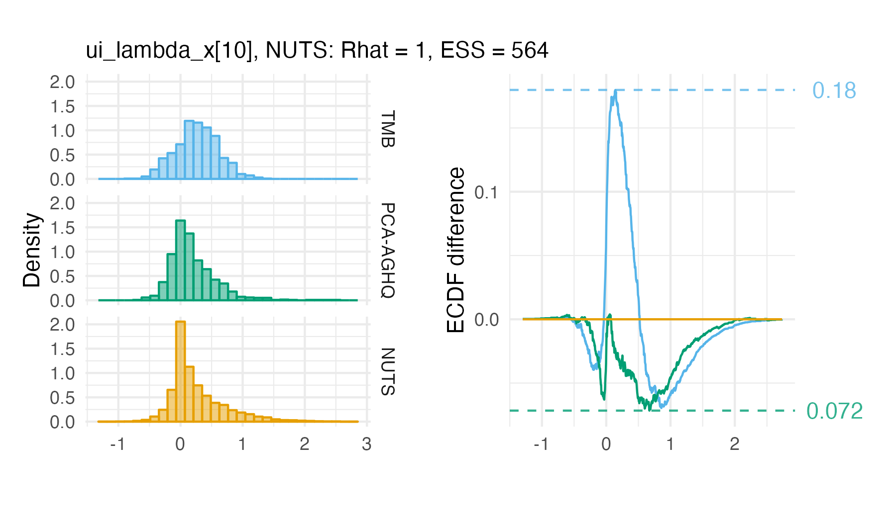

```{css, echo=FALSE}
div.logo_left{
  width: 35%;
  background-color: #E5E5E5;
}
div.poster_title{
  width: 60%;
}
div.title_container{
  background-color: #E5E5E5;
}
code{
  background-color: #ffffff;
  color: #000000;
}
.poster_body{
  column-rule-color: #ffffff;
}
```

## Summary

* We developed an approximate Bayesian inference method using Laplace approximation, adaptive Gauss-Hermite quadrature and principal component analysis
* Motivation: an evidence synthesis model for small-area estimation of HIV indicators in >35 countries in sub-Saharan Africa
* Implemented using the `aghq` package [@stringer2021implementing], and compatible with any model with a Template Model Builder `TMB` [@kristensen2016tmb] C++ user template

## 1. The Naomi HIV model

* District-level model of HIV indicators which synthesises data from 1) household surveys, 2) antenatal care (ANC) clinics, and 3) routine service provision of antiretroviral therapy (ART) [@eaton2021naomi]
  * Combining evidence from multiple data sources helps overcome the limitations of any one
  * Small-area estimation methods (structured random effects) to overcome limited district-level sample sizes
* Yearly estimation process: model run interactively by by country teams using `naomi.unaids.org` web-app
  * Figure \@ref(fig:fig1) illustrates the seven stages of using the app
* Inference conducted in minutes using empirical Bayes and a Gaussian approximation
* Days to get accurate answers with MCMC via `tmbstan` [@monnahan2018no]: not practical!
* Naomi has a large latent field $x$ controlled by a smaller number of hyperparameters $\theta$
* Extended latent Gaussian model [@stringer2022fast]: more complex dependency structures than a latent Gaussian model
* Looking for a fast, approximate approach, that properly takes uncertainty in hyperparameters into account

```{r fig1, echo=FALSE, fig.align='center', out.width='100%', fig.cap='Model fitting occurs interactively in stages'}

```

## 2. Inference procedure

```{r fig2, echo=FALSE, fig.align='center', fig.cap='Demonstration of Gauss-Hermite quadrature, adaption, and our principal components approach.'}
knitr::include_graphics("fig2.png")
```

* **Laplace approximation** Integrate out latent field using a Gaussian approximation to the denominator
$$
p(\theta, y) \approx \tilde p_\texttt{LA}(\theta, y) = \frac{p(y, x, \theta)}{\tilde p_\texttt{G}(x \, | \, \theta, y)} \Big\rvert_{x = \hat x(\theta)},
$$
where $\tilde p_\texttt{G}(x \, | \, \theta, y) = \mathcal{N}(x \, | \, \hat x(\theta), \hat H(\theta)^{-1})$
  * Use automatic differentiation via `CppAD` in `TMB`
* **Adaptive Gauss-Hermite Quadrature** (AGHQ) perform quadrature over the hyperparameters
$$
\int_\Theta p_\texttt{LA}(\theta, y) \text{d} \theta \approx \lvert L \rvert \sum_{z \in \mathcal{Q}(m, k)} p_\texttt{LA}(\hat \theta + Lz, y) \omega(z),
$$
where $m = \dim(\theta)$ and the Gauss-Hermite quadrature rule $z \in \mathcal{Q}(m, k)$ with weights $\omega:\mathcal{Q} \mapsto \mathbb{R}$ and $k$ points per dimension is adapted (Figure 2) based upon
  * The mode $\hat \theta = \text{argmax}_{\theta \in \Theta} p_\texttt{LA}(\theta, y)$
  * A matrix decomposition $LL^\top = - \partial_\theta^2 \log p_\texttt{LA}(\theta, y) \rvert_{\theta = \hat \theta}$
* **PCA-AGHQ** To integrate over large spaces, use the spectral decomposition $L = E\Lambda^{1/2}$ and keep only the first $s < m$ principal components

## 3. Application to Malawi

* Malawi is a relatively small country but still has latent field $\text{dim}(x) = 491$ and hyperparameters $\text{dim}(\theta) = 24$

```{r fig3, echo=FALSE, fig.align='center', fig.cap='District-level model outputs for adults 15-49.'}
knitr::include_graphics("fig3.png")
```

```{r echo=FALSE, message=FALSE, warning=FALSE}
time_taken <- readr::read_csv("depends/time-taken.csv")
```

```{r echo=FALSE, message=FALSE, warning=FALSE}
ks <- readRDS("depends/ks-summary.rds")

ks_reduction <- ks %>%
  filter(type == "Latent") %>%
  summarise(
    ks_tmb = mean(TMB),
    ks_aghq = mean(aghq)
  ) %>%
  mutate(reduction = 100 * (ks_aghq - ks_tmb) / ks_tmb) %>%
  pull(reduction) %>%
  round()

exceedance_summary <- read_csv("depends/exceedance-summary.csv")
second90_rmse <- filter(exceedance_summary, indicator == "Second 90", method == "PCA-AGHQ")$rmse_diff
```

* Run three methods: 1. TMB (baseline, `r round(time_taken$TMB, 0)` secs), 2. PCA-AGHQ (new, `r round(time_taken$aghq, 0)` hour), 3. NUTS (gold-standard, `r round(time_taken$tmbstan, 1)` days)
  * For PCA-AGHQ $k = 3$ and $s = 8$ chosen using Scree plot to explain ~90% of variance
  * For NUTS 4 chains of 100,000 thinned by 40 were required for good diagnostics e.g. all $\hat R < 1.025$
* Naomi can be used to assess probabilities targets have been met e.g. 90% of those who know their HIV status are on ART ("second 90")
  * Though PCA-AGHQ is better (`r round(second90_rmse, 0)`% RMSE), both TMB and PCA-AGHQ are biased (Figure 5)

```{r fig5, echo=FALSE, fig.align='center', fig.cap='PCA-AGHQ somewhat improves the second 90 bias.'}

```

## 4. Future directions

* **Can we do any better than modest improvements?**
* Laplace marginals with matrix algebra approximations [@wood2020simplified] to speed up calculations
* Further methods for allocation of effort to "important" dimensions of hyperparameter grid

**Funding** AH was supported by the EPSRC and Bill & Melinda Gates Foundation. This research was supported by the MRC Centre for Global Infectious Disease Analysis.

**Contact** `r fontawesome::fa("home", fill = "black")` `athowes.github.io`; `r fontawesome::fa("envelope", fill = "black")` `ath19@ic.ac.uk`

## References

<font size="5"> <div id="refs" class="references"></div> </font>
